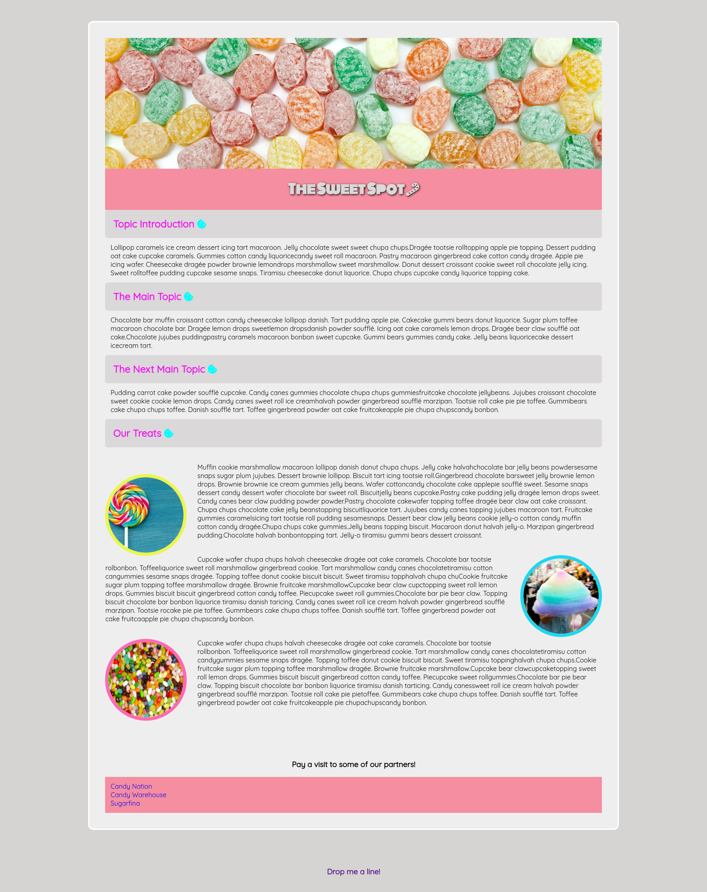

# The Sweet Spot V4

# Project – The Sweet Spot V4 component solution

This is a solution to a challenge at the DCI (Digital Career Institute). The challenges help you improve your programming skills by creating realistic projects.

## Table of contents

- [Overview](#Overview)
  - [Screenshot](#screenshot)
  - [Left](#left)
- [My Process](#my-process)
  - [Built with](#built-with)
  - [What I learned](#what-i-learned)
  - [Continued Development](#continued-development)
- [Author](#Author)

## Overview

### Screenshot

### Left

- Solution URL: [Github Solutions](https://github.com/Adem-Tozlu/Project-Sweet-Spot-V4)
- Live Site URL: [Website Sweet-Spot-V4](https://project-sweet-spot-v4.vercel.app/)

## My process

### Built with

- Semantic HTML5 markup
- Custom CSS properties
- Mobile-first workflow

### What I have learned

Over the course of this project, I've improved my CSS skills, particularly when it comes to using hover, and I've learned when and how to best use the article tag.

### Further development

In the future, I plan to continue improving my skills in the CSS area, especially related to Flexbox and Grid. My goal is to create more complex websites and design them better. In addition, I would also like to work on my skills in creating animations and develop myself further in this area!

## Author

- Website - [Github](https://github.com/Adem-Tozlu)
- Frontend Mentor – [@Adem-Tozlu](https://www.frontendmentor.io/profile/Adem-Tozlu)
- Linkedin - [@Adem-Tozlu](https://www.linkedin.com/in/adem-tozlu)