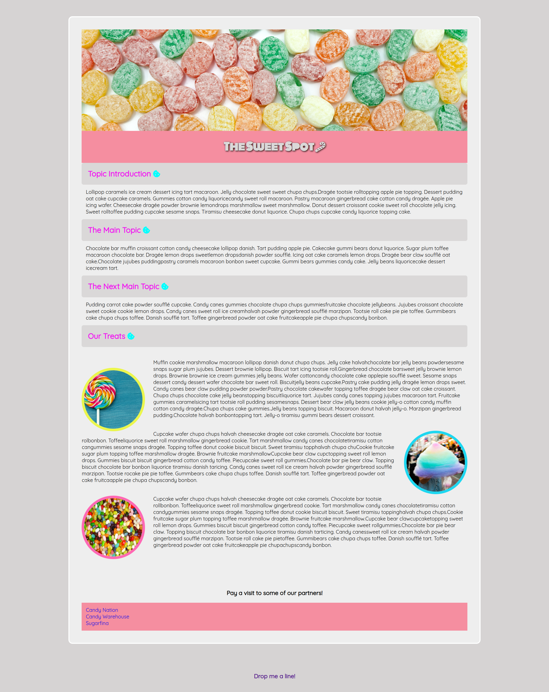

# The Sweet Spot V4

# Project – The Sweet Spot v4 Komponentenlösung

Dies ist eine Lösung für eine Herausforderung bei der DCI(Digital Career Institut). Die Herausforderungen helfen Ihnen, Ihre Programmierfähigkeiten zu verbessern, indem Sie realistische Projekte erstellen.

## Inhaltsverzeichnis

- [Übersicht](#Übersicht)
  - [Screenshot](#screenshot)
  - [Links](#links)
- [Mein Prozess](#my-process)
  - [Erstellt mit](#built-with)
  - [Was ich gelernt habe](#what-i-learned)
  - [Fortsetzung der Entwicklung](#continued-development)
- [Autor](#Autor)

## Überblick

### Bildschirmfoto

### Links

- Lösungs-URL: [Github-Lösungen](https://github.com/Adem-Tozlu/Project-Sweet-Spot-V4)
- Live-Site-URL: [Website Sweet-Spot-V4](https://project-sweet-spot-v4.vercel.app/)

## Mein Prozess

### Gebaut mit

- Semantisches HTML5-Markup
- Benutzerdefinierte CSS-Eigenschaften
- Mobile-First-Workflow

### Was ich gelernt habe

Im Verlauf dieses Projekts habe ich meine Fähigkeiten im Bereich CSS verbessert, insbesondere was die Verwendung von "hover" betrifft, und ich habe gelernt, wann und wie ich den "article"-Tag am besten einsetze.

### Weiterentwicklung

In Zukunft plane ich, meine Fähigkeiten im CSS-Bereich weiter zu verbessern, insbesondere im Zusammenhang mit Flexbox und Grid. Mein Ziel ist es, komplexere Websites zu erstellen und diese besser zu gestalten. Darüber hinaus möchte ich auch an meinen Fähigkeiten im Erstellen von Animationen arbeiten und mich in diesem Bereich weiterentwickeln!

## Autor

- Website - [Github](https://github.com/Adem-Tozlu)
- Frontend-Mentor – [@Adem-Tozlu](https://www.frontendmentor.io/profile/Adem-Tozlu)
- Linkedin - [@Adem-Tozlu](https://www.linkedin.com/in/adem-tozlu-8906b52a5)